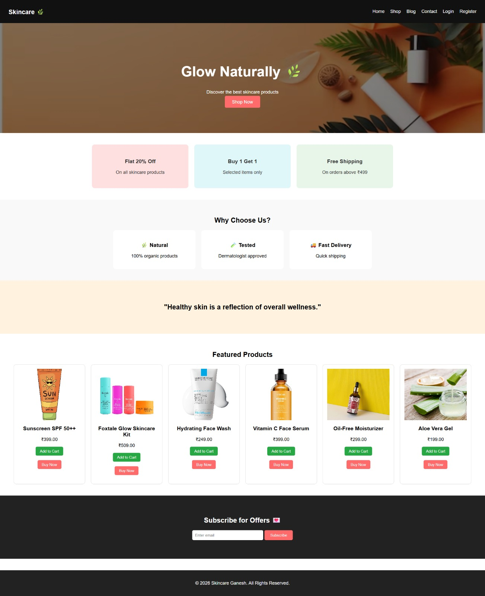
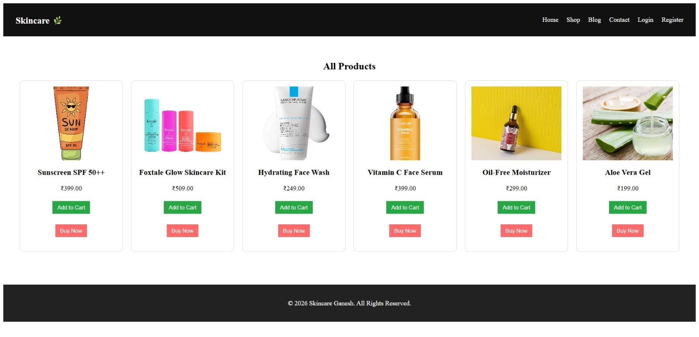
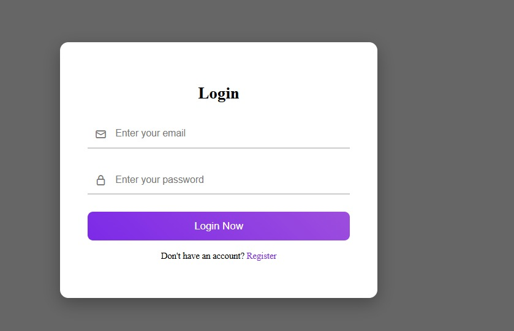
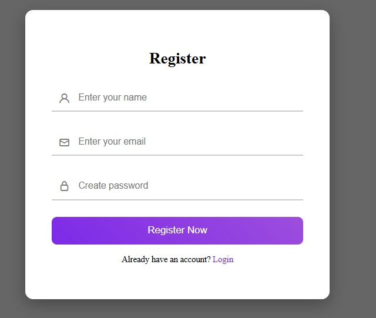
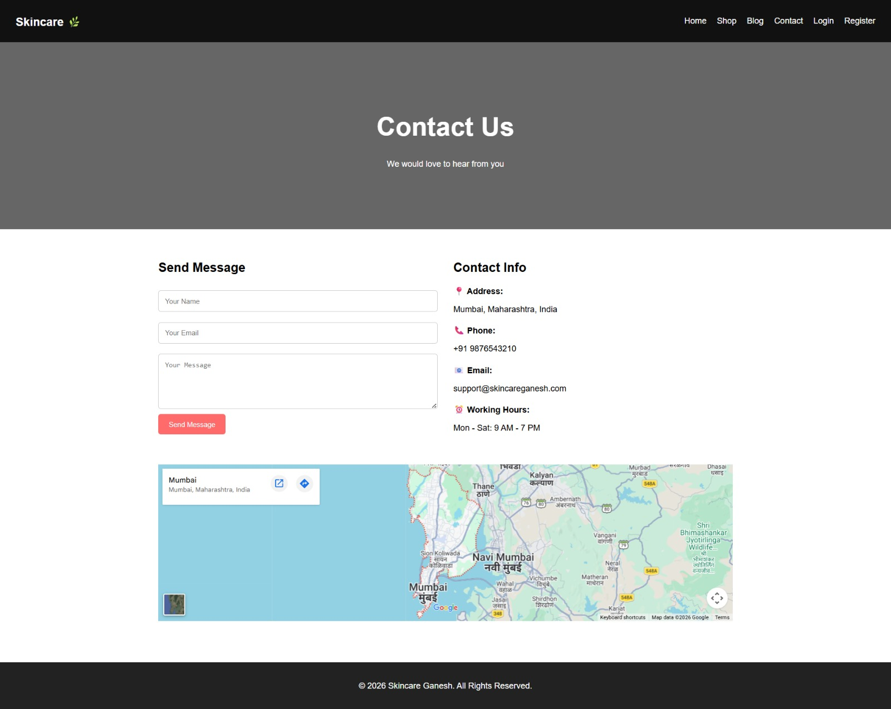

# 🌿 Skincare Website (Project Demo)

This is a demo showcase of a full-stack skincare eCommerce web application developed using PHP and MySQL.  
The project focuses on providing a smooth shopping experience with user authentication and cart functionality.

---

## 🚀 Features

- 🔐 User Authentication (Login/Register)
- 🛍️ Product Browsing
- 🛒 Add to Cart System
- 📦 Product Management
- 📬 Contact Form

---

## 🛠️ Tech Stack

- HTML, CSS, JavaScript  
- PHP  
- MySQL  
- XAMPP  

---

## 📸 Screenshots

### 🏠 Home Page

### 🛍️ Shop Page

### 🔐 Login Page

### 📝 Register Page

### 📞 Contact Page

---

## 🎯 Purpose

This project was built to gain hands-on experience in full-stack development and understand real-world eCommerce workflows.

---

## 🔒 Note

This is a demo repository created for showcasing purposes.  
The complete source code is maintained privately.

---

## 👨‍💻 Author

**Piyush Bihare**
